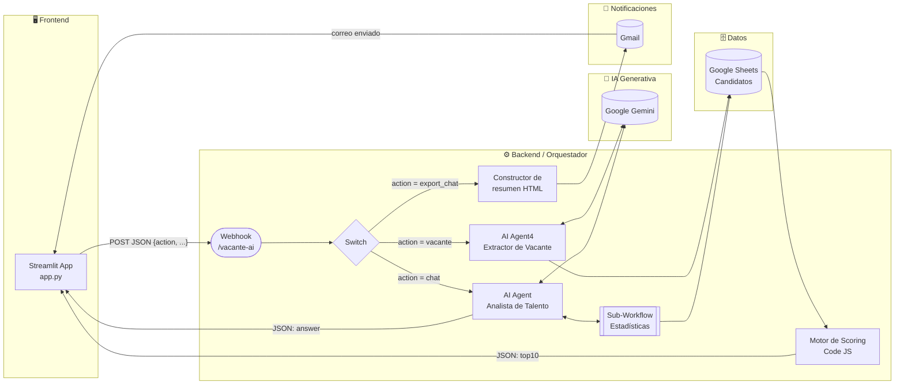
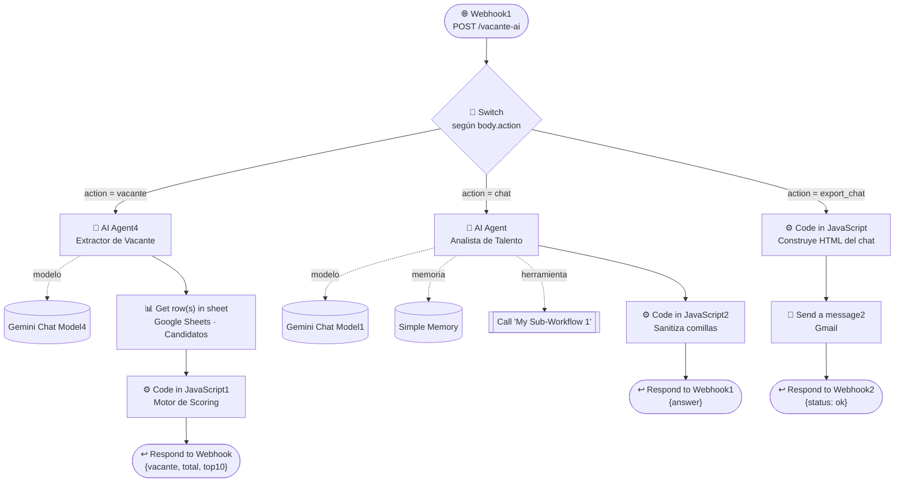
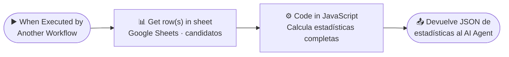
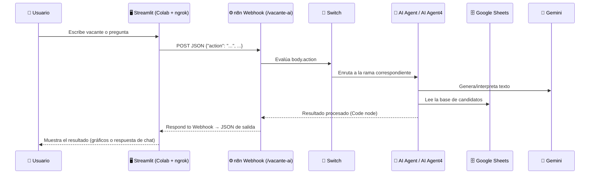

# 🤖 SmartRecruit AI

Sistema inteligente de clasificación y *matching* de hojas de vida, construido con **n8n** (orquestación + IA), **Google Gemini** (modelo de lenguaje), **Google Sheets** (base de datos de candidatos) y **Streamlit** (interfaz web).

El sistema permite a un reclutador hacer dos cosas:

1. **Pegar la descripción de una vacante en texto libre** y recibir automáticamente un ranking de los 10 candidatos más afines, con un puntaje de compatibilidad calculado algorítmicamente.
2. **Conversar en lenguaje natural** con un agente de IA que conoce las estadísticas completas de la base de candidatos (profesiones, universidades, experiencia, inglés, habilidades, salarios, etc.) y puede exportar el resumen de esa conversación por correo electrónico.

---

## 📑 Tabla de contenidos

1. [¿Qué es este proyecto?](#-qué-es-este-proyecto)
2. [Arquitectura general](#-arquitectura-general)
3. [Conceptos clave](#-conceptos-clave)
   - [¿Qué es n8n?](#qué-es-n8n)
   - [¿Qué es un Webhook?](#qué-es-un-webhook)
   - [¿Qué es JSON y por qué se usa en este proyecto?](#qué-es-json-y-por-qué-se-usa-en-este-proyecto)
   - [¿Qué es un Agente de IA?](#qué-es-un-agente-de-ia)
   - [¿Qué es Streamlit?](#qué-es-streamlit)
4. [Base de datos de candidatos](#-base-de-datos-de-candidatos)
5. [Workflow principal — `proyecto.json`](#-workflow-principal--proyectojson)
   - [Rama 1 — Análisis de vacante](#rama-1--análisis-de-vacante-actionvacante)
   - [Rama 2 — Chat ATS](#rama-2--chat-ats-actionchat)
   - [Rama 3 — Exportar conversación](#rama-3--exportar-conversación-actionexport_chat)
6. [Sub-Workflow de estadísticas — `My_Sub-Workflow_1.json`](#-sub-workflow-de-estadísticas--my_sub-workflow_1json)
7. [Aplicación Streamlit](#-aplicación-streamlit)
8. [Cómo se conecta Streamlit con n8n](#-cómo-se-conecta-streamlit-con-n8n)
9. [Instalación y puesta en marcha](#-instalación-y-puesta-en-marcha)
10. [Estructura del repositorio](#-estructura-del-repositorio)
11. [Tecnologías utilizadas](#-tecnologías-utilizadas)
12. [Limitaciones y mejoras futuras](#-limitaciones-y-mejoras-futuras)
13. [Licencia](#-licencia)

---

## 📌 ¿Qué es este proyecto?

**SmartRecruit AI** automatiza dos tareas que tradicionalmente le toman horas a un reclutador:

| Problema tradicional | Solución de SmartRecruit AI |
|---|---|
| Leer manualmente decenas de hojas de vida para encontrar las que mejor calzan con una vacante | El sistema lee la base de candidatos, calcula un puntaje de compatibilidad (0–100) para cada uno y devuelve el Top 10 en segundos |
| Buscar estadísticas de la base de candidatos (cuántos saben Python, cuántos tienen inglés C1, salario promedio, etc.) revisando una hoja de cálculo a mano | Un agente conversacional responde esas preguntas en lenguaje natural, basado siempre en datos reales y nunca inventados |
| Llevar un registro de las conversaciones con el ATS | El usuario puede pedir que se le envíe por correo un resumen de toda la conversación |

Todo el procesamiento (lectura de la base de datos, extracción de información con IA, cálculo del ranking, generación de respuestas y envío de correos) ocurre en **n8n**, mientras que **Streamlit** se encarga únicamente de mostrar una interfaz amigable al usuario final.

---

## 🏗️ Arquitectura general

El proyecto está dividido en cuatro grandes bloques que se comunican entre sí mediante **JSON** sobre **HTTP**:



**Resumen de cada bloque:**

- **Streamlit** es la única parte visible para el usuario: un formulario para describir una vacante y un chat para hacer preguntas.
- **n8n** es el cerebro del sistema: recibe la petición, decide qué hacer según el campo `action`, llama a Gemini cuando necesita razonamiento o extracción de datos, lee la hoja de cálculo y devuelve una respuesta en JSON.
- **Google Sheets** funciona como base de datos: una tabla con 100 candidatos y sus atributos (profesión, experiencia, habilidades, etc.).
- **Google Gemini** es el modelo de lenguaje que entiende texto libre (la vacante o la pregunta del usuario) y genera respuestas o datos estructurados.

---

## 🧩 Conceptos clave

Antes de entrar en el detalle técnico, conviene entender las piezas que hacen posible este proyecto.

### ¿Qué es n8n?

[n8n](https://n8n.io) es una herramienta de **automatización de flujos de trabajo (workflow automation)** de código abierto. Permite construir procesos completos — conectar APIs, bases de datos, modelos de IA, correo, etc. — uniendo **nodos** visualmente, en lugar de escribir un backend completo desde cero.

Cada **nodo** representa una acción (leer una hoja de Google Sheets, llamar a un modelo de IA, ejecutar código JavaScript, enviar un correo, responder una petición HTTP) y se conecta con otros nodos formando un **workflow**. Los datos viajan de un nodo a otro siempre en formato **JSON**, lo que permite que cualquier nodo pueda leer, transformar o enriquecer la información que recibe del nodo anterior.

En este proyecto, n8n cumple el rol de **backend completo**: recibe peticiones desde Streamlit, decide qué lógica ejecutar, consulta la base de datos, conversa con la IA y devuelve una respuesta, sin necesidad de programar un servidor tradicional (Flask, Express, Django, etc.).

### ¿Qué es un Webhook?

Un **webhook** es una URL pública que un servidor expone para "escuchar" peticiones HTTP entrantes. En n8n, el nodo **Webhook** crea automáticamente esa URL: cualquier aplicación externa (en este caso, Streamlit) puede enviarle datos mediante una petición `POST`, y eso dispara la ejecución del workflow. Es, en la práctica, la puerta de entrada de todo el sistema.

### ¿Qué es JSON y por qué se usa en este proyecto?

**JSON** (*JavaScript Object Notation*) es un formato de texto ligero para representar datos estructurados mediante pares `clave: valor`, listas y objetos anidados. Es el estándar universal para intercambiar información entre aplicaciones web porque:

- Es **legible** tanto para humanos como para máquinas.
- Es **nativo de JavaScript** (el lenguaje de los nodos *Code* de n8n) y tiene soporte directo en Python (`requests`, `json`), por lo que Streamlit y n8n lo entienden sin conversiones adicionales.
- Permite representar **estructuras complejas** (un candidato con sus habilidades en una lista, una vacante con varios campos, un historial de chat como arreglo de mensajes) en un solo bloque de datos.

En SmartRecruit AI, JSON se usa en **todas** las comunicaciones:

- Streamlit envía la vacante o la pregunta del usuario como JSON (`{"action": "vacante", "vacante": "..."}`).
- n8n exporta los dos workflows del proyecto como archivos `.json` (`proyecto.json` y `My_Sub-Workflow_1.json`): es la forma en que n8n serializa nodos, conexiones, parámetros y credenciales para poder respaldarlos, versionarlos en Git o importarlos en otra instancia.
- El modelo Gemini, dentro del flujo de "Análisis de vacante", es **forzado mediante el prompt** a devolver su respuesta como JSON, para que el siguiente nodo (`Code in JavaScript1`) pueda parsearla y trabajar con ella como un objeto.
- La respuesta final que recibe Streamlit (el Top 10 de candidatos, o la respuesta del chat) también viaja como JSON.

### ¿Qué es un Agente de IA?

Un **agente de IA** (en n8n, el nodo `@n8n/n8n-nodes-langchain.agent`, basado en [LangChain](https://www.langchain.com/)) es un modelo de lenguaje al que se le da:

- Un **rol y reglas de comportamiento** (`systemMessage`/`prompt`).
- Opcionalmente, **memoria** para recordar el historial de la conversación.
- Opcionalmente, **herramientas (`tools`)** que puede invocar para obtener información que no posee de forma nativa (en este proyecto, un sub-workflow que calcula estadísticas).

A diferencia de simplemente "llamarlo" con un prompt, un agente puede **decidir** si necesita usar una herramienta antes de responder, lo que le permite basar sus respuestas en datos reales en lugar de inventarlos.

### ¿Qué es Streamlit?

[Streamlit](https://streamlit.io/) es un framework de Python para construir aplicaciones web interactivas (dashboards, formularios, chats) sin necesidad de escribir HTML, CSS o JavaScript. Con unas pocas líneas de Python (`st.title`, `st.text_area`, `st.button`, `st.chat_message`, etc.) se genera una interfaz web funcional. En este proyecto, Streamlit es **únicamente la capa visual**: no contiene lógica de negocio, solo recoge la entrada del usuario, la envía a n8n vía HTTP y muestra el resultado.

---

## 🗄️ Base de datos de candidatos

La base de datos vive en **Google Sheets** (los nodos `Get row(s) in sheet` la leen directamente desde ahí). El archivo `Candidatos.xlsx` incluido en este repositorio es una copia/respaldo de esa hoja con **100 candidatos** y las siguientes columnas:

| Columna | Tipo | Descripción |
|---|---|---|
| `id` | Número | Identificador único del candidato |
| `nombre` | Texto | Nombre completo |
| `correo` | Texto | Correo de contacto |
| `telefono` | Número | Teléfono de contacto |
| `linkedin` | URL | Perfil de LinkedIn |
| `profesion` | Texto | Profesión / rol (15 valores: *Ingeniero de Software, Desarrollador Backend, Analista de Datos, Ingeniero de Sistemas, Ingeniero de Telecomunicaciones, Desarrollador Frontend, Científico de Datos, Ingeniero de IA, Ingeniero Industrial, Ingeniero Electrónico*, y sus variantes en femenino) |
| `experiencia_anios` | Número | Años de experiencia laboral |
| `habilidades` | Texto (CSV) | Lista de habilidades técnicas separadas por coma (ej. `Python, TensorFlow, SQL`) |
| `universidad` | Texto | Universidad de procedencia (15 universidades colombianas) |
| `ciudad` | Texto | Ciudad de residencia |
| `ingles` | Texto | Nivel de inglés según el MCER: `A1`, `A2`, `B1`, `B2`, `C1`, `C2` |
| `certificaciones` | Texto | Certificación obtenida (ej. *AWS Cloud Practitioner*, *Scrum Fundamentals*) o `"Ninguna"` |
| `expectativa_salarial` | Número | Expectativa salarial en COP |
| `modalidad` | Texto | `Presencial`, `Híbrido` o `Remoto` |

> 💡 Esta misma estructura es la que consumen tanto el workflow principal (hoja **"Candidatos"**) como el sub-workflow de estadísticas (hoja **"Candidatos_Agente"**). Si se duplica la base, ambos nodos `Get row(s) in sheet` deben apuntar al `documentId` correcto.

---

## ⚙️ Workflow principal — `proyecto.json`

Este es el workflow que recibe **todas** las peticiones desde Streamlit a través de un único webhook, y las enruta según el campo `action` que envía cada módulo del frontend.



### Nodo de entrada: `Webhook1`

```json
{
  "httpMethod": "POST",
  "path": "vacante-ai",
  "responseMode": "responseNode"
}
```

Crea la URL pública `https://<tu-instancia-n8n>/webhook/vacante-ai`. Es el único punto de entrada del backend: Streamlit envía aquí **todas** sus peticiones (las de los tres módulos), y `responseMode: "responseNode"` indica que la respuesta al cliente la construirá explícitamente un nodo `Respond to Webhook` más adelante en el flujo, en lugar de devolver una respuesta automática.

### Nodo enrutador: `Switch`

Evalúa el campo `body.action` que llega en la petición y dirige la ejecución a una de tres ramas:

| Valor de `action` | Rama de salida | Qué hace |
|---|---|---|
| `"vacante"` | 0 | Analiza una vacante y devuelve el ranking de candidatos |
| `"chat"` | 1 | Responde una pregunta en lenguaje natural sobre la base de datos |
| `"export_chat"` | 2 | Envía por correo un resumen de la conversación |

Este patrón de **un solo webhook + un Switch interno** es el equivalente, en n8n, a tener varias rutas (`/vacante`, `/chat`, `/export`) en un backend tradicional, pero usando un único endpoint y un campo de control (`action`) para diferenciarlas.

---

### Rama 1 — Análisis de vacante (`action: "vacante"`)

#### `AI Agent4` — Extractor de datos de la vacante

Este agente **no tiene memoria ni herramientas**: su único trabajo es convertir el texto libre de la vacante (escrito por el reclutador) en un objeto JSON con estructura fija, para que el siguiente nodo pueda procesarlo matemáticamente.

**Prompt utilizado:**

```text
Eres un sistema de extracción de datos.

Devuelve SOLO JSON válido.

⚠️ REGLAS OBLIGATORIAS:
NO uses markdown
NO uses texto adicional
NO uses claves con espacios
NO uses números como índices en arrays
NO uses formato Python
SOLO JSON válido estándar

📌 FORMATO EXACTO:

{
  "cargo": "string",
  "skills": ["string"],
  "experiencia": number,
  "ingles": "A1|A2|B1|B2|C1|C2",
  "modalidad": "Presencial|Remoto|Híbrido",
  "salario": number
}

📌 IMPORTANTE:
skills debe ser array real JSON ["python", "tensorflow"]
todo en minúscula en skills
ingles en mayúscula
modalidad capitalizada correctamente
experiencia número entero

📌 VACANTE:
{{ $json.body.vacante }}

SI NO PUEDES CUMPLIRLO, RESPONDE:
{}
```

**Por qué está escrito así:** los modelos de lenguaje tienden a "decorar" sus respuestas (agregar explicaciones, usar bloques ```` ```json ````, etc.). Como el nodo de código que sigue necesita un JSON **parseable**, el prompt es extremadamente estricto y repite varias veces la prohibición de añadir texto extra. Además, define una cláusula de salida segura (`{}`) para los casos en que el modelo no pueda cumplir el formato, evitando que rompa el flujo con texto inesperado.

#### `Get row(s) in sheet` — Lectura de la base de candidatos

Nodo `n8n-nodes-base.googleSheets` que lee **todas las filas** de la hoja `candidatos` del spreadsheet `Candidatos`. Cada fila se convierte en un ítem JSON independiente que viaja al siguiente nodo.

#### `Code in JavaScript1` — Motor de Scoring (el corazón del ranking)

Este es el nodo más importante de la rama. Toma el JSON generado por `AI Agent4` (la vacante estructurada) y la lista completa de candidatos, y calcula un **puntaje de compatibilidad de 0 a 100** para cada uno.

```javascript
// ======================
// 1. LIMPIAR JSON DE GEMINI
// ======================
// Gemini a veces envuelve su respuesta en ```json ... ``` o agrega texto
// antes/después del objeto. Aquí se extrae solo lo que está entre { y }.
let raw = $('AI Agent').first().json.output || "";

raw = raw
  .replace(/```json/gi, "")     // quita la apertura de bloque markdown
  .replace(/```/g , "")         // quita el cierre de bloque markdown
  .replace(/^[^\{]*/, "")       // elimina cualquier texto antes del primer "{"
  .replace(/[^\}]*$/, "")       // elimina cualquier texto después del último "}"
  .trim();

let vacante;
try {
  vacante = JSON.parse(raw);    // intenta convertir el texto limpio en objeto JS
} catch (e) {
  // Si el JSON sigue siendo inválido, se corta el flujo devolviendo un error
  // controlado en lugar de que n8n lance una excepción sin contexto.
  return [{ json: { error: true, mensaje: "JSON inválido", raw: raw } }];
}

// ======================
// 2. NORMALIZACIÓN DE LA VACANTE
// ======================
// Unifica sinónimos/errores comunes de escritura en las habilidades
// (ej: "piton" -> "python") para que las comparaciones de texto coincidan.
function normalizarSkill(skill) {
  skill = String(skill)
    .toLowerCase()
    .normalize("NFD").replace(/[\u0300-\u036f]/g, "") // quita tildes
    .trim();

  const alias = {
    "piton": "python", "python3": "python", "py": "python",
    "esp-32": "esp32", "internet of things": "iot",
    "machine learning": "ml", "aprendizaje automatico": "ml",
    "inteligencia artificial": "ia", "artificial intelligence": "ia"
  };

  return alias[skill] || skill;
}

// Reconstruye el objeto "vacante" garantizando tipos correctos,
// aceptando nombres alternativos de campo (cargo/carga, skills/habilidades, etc.)
vacante = {
  cargo: String(vacante.cargo || vacante.carga || "").trim(),
  skills: Array.isArray(vacante.skills)
    ? vacante.skills.map(s => normalizarSkill(s))
    : Array.isArray(vacante.habilidades)
      ? vacante.habilidades.map(s => normalizarSkill(s))
      : [],
  experiencia: Number(vacante.experiencia || 0),
  ingles: String(vacante.ingles || "").toUpperCase().trim(),
  modalidad: String(vacante.modalidad || "").trim(),
  salario: Number(vacante.salario || vacante.sueldo || 0)
};

// ======================
// 3. TABLAS DE APOYO PARA EL SCORING
// ======================
const candidatos = $input.all();

// Escala numérica de niveles de inglés, para poder comparar candidato vs. vacante
const niveles = { A1: 1, A2: 2, B1: 3, B2: 4, C1: 5, C2: 6 };

// Puntaje de prestigio asignado a cada universidad (0-100). Las que no
// aparecen en la tabla reciben un puntaje base de 70 más adelante.
const puntajesUniversidad = {
  "Universidad Nacional de Colombia": 100,
  "Universidad de los Andes": 98,
  "Universidad de Antioquia": 95,
  // ...resto de universidades con su puntaje (ver código completo en el workflow)
  "Universidad Central": 70
};

// Da 20 puntos si la profesión del candidato coincide con el área del
// cargo solicitado, 15 si es un área afín de software, 0 si no hay relación.
function scoreProfesion(profesion, cargo) {
  profesion = String(profesion || "").toLowerCase()
    .normalize("NFD").replace(/[\u0300-\u036f]/g, "");
  cargo = String(cargo || "").toLowerCase()
    .normalize("NFD").replace(/[\u0300-\u036f]/g, "");

  if (profesion.includes("electron") && cargo.includes("electron")) return 20;
  if (profesion.includes("telecom") && cargo.includes("telecom")) return 20;
  if (profesion.includes("sistemas") && cargo.includes("sistemas")) return 20;
  if (profesion.includes("software") && cargo.includes("software")) return 20;
  if (profesion.includes("ia") && cargo.includes("ia")) return 20;
  if ((profesion.includes("datos") || profesion.includes("cientifico")) && cargo.includes("datos")) return 20;
  if (profesion.includes("industrial") && cargo.includes("industrial")) return 20;

  if ((profesion.includes("software") || profesion.includes("backend") || profesion.includes("frontend")) &&
      (cargo.includes("software") || cargo.includes("backend") || cargo.includes("frontend"))) return 15;

  return 0;
}

function normalizarSkills(texto) {
  return String(texto || "").split(",").map(s => normalizarSkill(s)).filter(s => s.length > 0);
}

// ======================
// 4. CÁLCULO DEL RANKING
// ======================
const ranking = [];

for (const item of candidatos) {
  const c = item.json;
  let score = 0;

  // (a) Habilidades — hasta 35 puntos, proporcional al % de coincidencia
  const skillsCand = normalizarSkills(c.habilidades);
  let coincidencias = 0;
  for (const s of skillsCand) if (vacante.skills.includes(s)) coincidencias++;
  if (vacante.skills.length > 0) score += (coincidencias / vacante.skills.length) * 35;

  // (b) Experiencia — hasta 25 puntos, satura en 1 si el candidato cumple o supera lo pedido
  const exp = Number(c.experiencia_anios || 0);
  const expReq = Number(vacante.experiencia || 0);
  score += expReq > 0 ? Math.min(exp / expReq, 1) * 25 : 25;

  // (c) Inglés — hasta 10 puntos, comparando niveles A1-C2 convertidos a escala 1-6
  const nivCand = niveles[String(c.ingles || "").toUpperCase()] || 1;
  const nivReq = niveles[String(vacante.ingles || "").toUpperCase()] || 1;
  score += vacante.ingles ? Math.min(nivCand / nivReq, 1) * 10 : 10;

  // (d) Universidad — hasta 5 puntos, según la tabla de prestigio (70 por defecto)
  const puntUni = puntajesUniversidad[c.universidad] || 70;
  score += (puntUni / 100) * 5;

  // (e) Profesión / cargo — hasta 20 puntos
  score += scoreProfesion(c.profesion, vacante.cargo);

  // (f) Certificaciones — 5 puntos extra si tiene alguna certificación real
  if (c.certificaciones && String(c.certificaciones).toLowerCase() !== "ninguna") score += 5;

  ranking.push({
    nombre: c.nombre, profesion: c.profesion, experiencia: exp,
    ingles: c.ingles, universidad: c.universidad, habilidades: c.habilidades,
    puntaje: Number(score.toFixed(2))
  });
}

// ======================
// 5. ORDENAR, FILTRAR Y DEVOLVER EL TOP 10
// ======================
ranking.sort((a, b) => b.puntaje - a.puntaje);
const top10 = ranking.slice(0, 10);

const PUNTAJE_MINIMO = 50; // candidatos por debajo de este puntaje se descartan
const top10Filtrado = top10.filter(c => c.puntaje >= PUNTAJE_MINIMO);

if (top10Filtrado.length === 0) {
  // Si nadie califica, se devuelve un mensaje explicativo en lugar de una lista vacía sin contexto
  return [{ json: {
    vacante, total_candidatos: 0, top10: [],
    mensaje: `No se encontraron candidatos que cumplan con las condiciones de esta vacante. Se revisaron ${ranking.length} perfiles y ninguno superó el puntaje mínimo requerido.`
  }}];
}

return [{ json: { vacante, total_candidatos: ranking.length, top10: top10Filtrado, mensaje: null } }];
```

**Resumen de la fórmula de scoring (100 puntos máximo):**

| Criterio | Peso máximo | Cómo se calcula |
|---|---|---|
| Habilidades (skills) | 35 pts | `(coincidencias / skills_requeridas) × 35` |
| Experiencia | 25 pts | `min(años_candidato / años_requeridos, 1) × 25` |
| Profesión / cargo | 20 pts | 20 si coincide el área exacta, 15 si es área afín, 0 si no aplica |
| Inglés | 10 pts | `min(nivel_candidato / nivel_requerido, 1) × 10` (escala A1=1 … C2=6) |
| Universidad | 5 pts | `(puntaje_universidad / 100) × 5` (tabla de prestigio, 70 por defecto) |
| Certificaciones | 5 pts | +5 si tiene alguna certificación distinta de "Ninguna" |
| **Umbral mínimo** | — | Solo se devuelven candidatos con puntaje **≥ 50** |

#### `Respond to Webhook` — Respuesta final

Devuelve al frontend el objeto generado por `Code in JavaScript1`: `{ vacante, total_candidatos, top10, mensaje }`.

---

### Rama 2 — Chat ATS (`action: "chat"`)

#### `AI Agent` — Analista de Talento conversacional

A diferencia del extractor de la rama anterior, este agente sí tiene **memoria** y una **herramienta**, porque su objetivo es sostener una conversación y responder con datos reales de la base.

**Prompt (`systemMessage`) utilizado:**

```text
Eres un analista de talento de SmartRecruit AI.

Tu única fuente de información es el tool "Call n8n Workflow Tool" que contiene
las estadísticas completas de la base de 100 candidatos.

REGLAS OBLIGATORIAS:
* Llama SIEMPRE al tool antes de responder cualquier pregunta.
* Nunca inventes datos.
* Si no encuentras el dato en el tool, responde: "No tengo esa información".
* Responde siempre en español.
* Sé breve, claro y profesional.

EL TOOL CONTIENE:
- Total de candidatos
- Profesiones y cantidad por cada una
- Universidades y candidatos por universidad
- Experiencia: promedio, mayores y menores de 5 y 10 años
- Niveles de inglés (A1, A2, B1, B2, C1, C2)
- Modalidades (Presencial, Híbrido, Remoto)
- Top 10 habilidades más comunes
- Certificaciones
- Salarios: promedio, mínimo y máximo

CAPACIDADES:
1. Contar candidatos por profesión o tipo.
2. Buscar candidatos por habilidades.
3. Estadísticas generales de la base.
4. Filtrar por inglés, universidad, experiencia o modalidad.
5. Salarios promedio y rangos.

EJEMPLOS:
Usuario: ¿Cuántos ingenieros electrónicos hay?
Respuesta: Hay X ingenieros electrónicos registrados.

Usuario: ¿Cuántos candidatos saben Python?
Respuesta: Hay X candidatos con la habilidad Python.

Usuario: ¿Hay médicos?
Respuesta: No hay candidatos para esa categoría.
```

**Por qué está diseñado así:** la instrucción *"Llama SIEMPRE al tool antes de responder"* combinada con *"Nunca inventes datos"* es la técnica que evita que el modelo **alucine** cifras. El agente no calcula nada por sí mismo: delega todo el cálculo numérico al sub-workflow de estadísticas (ver más abajo) y solo se encarga de interpretar la pregunta del usuario y redactar la respuesta en español. Los ejemplos al final (*few-shot prompting*) le muestran el formato esperado de respuesta.

Este agente recibe tres componentes conectados como entradas especiales (no como datos del flujo principal, sino como *sub-conexiones* del tipo `ai_*` propias de los nodos LangChain):

| Componente | Tipo de conexión | Función |
|---|---|---|
| `Google Gemini Chat Model1` (temperatura 0.4) | `ai_languageModel` | El modelo de lenguaje que razona y redacta la respuesta |
| `Simple Memory` (`memoryBufferWindow`, ventana de 10 mensajes) | `ai_memory` | Permite que el agente recuerde el contexto de los últimos mensajes del chat |
| `Call 'My Sub-Workflow 1'` | `ai_tool` | Herramienta que el agente puede invocar para obtener las estadísticas reales (ver sección del sub-workflow) |

> ⚠️ **Detalle importante:** el nodo `Simple Memory` usa una `sessionKey` **fija** (`"smartrecruit_session"`), lo que significa que, en la configuración actual, **todos los usuarios comparten el mismo historial de conversación**. Para un entorno multiusuario en producción, esta clave debería generarse dinámicamente (por ejemplo, a partir de un `session_id` enviado desde Streamlit).

#### `Code in JavaScript2` — Sanitización de la respuesta

```javascript
// Este código asegura que el texto no rompa el JSON
// Si la respuesta del agente contiene comillas dobles ("), estas se
// reemplazan por comillas simples (') para evitar que, al insertarlas
// dentro del JSON de respuesta, se generen caracteres de escape
// inválidos que rompan el parseo en el lado de Streamlit.
return {
  output: items[0].json.output.replace(/"/g, "'")
};
```

> 💡 Es una solución sencilla pero poco robusta: si el usuario pregunta algo cuya respuesta legítimamente necesita comillas dobles, estas se perderán. Una alternativa más segura sería usar `JSON.stringify()` sobre el texto completo en el nodo `Respond to Webhook1`.

#### `Respond to Webhook1` — Respuesta final

```json
{ "answer": "{{ $json.output }}" }
```

---

### Rama 3 — Exportar conversación (`action: "export_chat"`)

#### `Code in JavaScript` — Construcción del resumen en HTML

```javascript
const data = $input.first().json.body;
const email = data.email;
const historial = data.chat_history || [];

// Si no hay conversación previa, se responde con un mensaje simple
if (historial.length === 0) {
  return [{ json: {
    email: email,
    answer: "<p>No hay conversación para exportar.</p>"
  }}];
}

// Recorre cada mensaje del historial y arma un bloque HTML con
// estilos en línea, diferenciando visualmente usuario y asistente.
let resumen = "";
for (const msg of historial) {
  const rol = msg.role === "user" ? "👤 Usuario" : "🤖 Asistente";
  const bg = msg.role === "user" ? "#e8f0fe" : "#f1f3f4";
  resumen += `<div style="background:${bg};padding:10px;margin-bottom:8px;border-radius:6px">
                <strong>${rol}:</strong><br>${msg.content}
              </div>`;
}

const html = `<h2>Resumen del Chat - SmartRecruit AI</h2>${resumen}`;
return [{ json: { email: email, answer: html } }];
```

#### `Send a message2` — Envío por Gmail

Nodo `n8n-nodes-base.gmail` que envía el HTML generado al correo indicado por el usuario, con el asunto *"Resumen del chat - SmartRecruit AI"*.

#### `Respond to Webhook2` — Confirmación

Responde `{"status": "ok"}` a Streamlit para que la interfaz pueda mostrar un mensaje de éxito.

---

## 🔧 Sub-Workflow de estadísticas — `My_Sub-Workflow_1.json`

Este es un **workflow independiente** que no se ejecuta de forma autónoma: existe únicamente para ser invocado como **herramienta (`tool`)** por el `AI Agent` de la rama de chat, mediante el nodo `Call 'My Sub-Workflow 1'`.



### `When Executed by Another Workflow` — Trigger especial

Nodo `executeWorkflowTrigger` con `inputSource: "passthrough"`. No responde a un webhook HTTP; en cambio, se activa cuando **otro workflow** (en este caso, el `AI Agent` del workflow principal, a través del nodo *Tool Workflow*) lo invoca directamente. Es lo que permite usar este flujo completo como una "función" reutilizable.

### `Get row(s) in sheet` — Lectura de candidatos

Igual que en el workflow principal, lee todas las filas de la hoja de candidatos (en este caso del spreadsheet `Candidatos_Agente`).

### `Code in JavaScript` — Cálculo de estadísticas completas

Procesa los 100 candidatos y genera un único objeto JSON con **todas** las estadísticas que el agente de chat puede necesitar para responder cualquier pregunta:

```javascript
const candidatos = $input.all().map(i => i.json);
const total = candidatos.length;

// --- 1. PROFESIONES ---
// Conteo exacto por cada valor de "profesion" tal como aparece en la hoja
const profesiones = {};
for (const c of candidatos) {
  const prof = (c.profesion || "SIN_PROFESION").trim();
  profesiones[prof] = (profesiones[prof] || 0) + 1;
}

// Agrupación normalizada por "tipo" de profesión (junta singular/plural,
// masculino/femenino y variantes bajo una sola categoría general)
const tiposProfesion = {};
for (const c of candidatos) {
  let tipo = (c.profesion || "").toLowerCase()
    .normalize("NFD").replace(/[\u0300-\u036f]/g, "").trim();

  if (tipo.includes("software")) tipo = "Ingeniería de Software";
  else if (tipo.includes("datos") || tipo.includes("data")) tipo = "Datos / Ciencia de Datos";
  else if (tipo.includes("ia") || tipo.includes("inteligencia")) tipo = "Inteligencia Artificial";
  else if (tipo.includes("electroni")) tipo = "Ingeniería Electrónica";
  else if (tipo.includes("sistemas")) tipo = "Ingeniería de Sistemas";
  else if (tipo.includes("telecom")) tipo = "Telecomunicaciones";
  else if (tipo.includes("industrial")) tipo = "Ingeniería Industrial";
  else if (tipo.includes("backend")) tipo = "Desarrollo Backend";
  else if (tipo.includes("frontend")) tipo = "Desarrollo Frontend";
  else tipo = "Otra";

  tiposProfesion[tipo] = (tiposProfesion[tipo] || 0) + 1;
}

// --- 2. UNIVERSIDADES ---
const universidades = {};
for (const c of candidatos) {
  const uni = (c.universidad || "SIN_UNIVERSIDAD").trim();
  universidades[uni] = (universidades[uni] || 0) + 1;
}
const totalUniversidades = Object.keys(universidades).length;

// --- 3. EXPERIENCIA ---
// Calcula cuántos candidatos superan/no superan los 5 y 10 años,
// y el promedio general de años de experiencia.
let expMas10 = 0, expMenos10 = 0, expMas5 = 0, expMenos5 = 0, totalExp = 0;
for (const c of candidatos) {
  const exp = Number(c.experiencia_anios || 0);
  totalExp += exp;
  if (exp >= 10) expMas10++; else expMenos10++;
  if (exp >= 5) expMas5++; else expMenos5++;
}
const promedioExperiencia = total > 0 ? Number((totalExp / total).toFixed(1)) : 0;

// --- 4. INGLÉS ---
// Distribución por nivel exacto, más agrupación en alto/medio/bajo
const niveles = {};
for (const c of candidatos) {
  const nivel = (c.ingles || "SIN_NIVEL").trim().toUpperCase();
  niveles[nivel] = (niveles[nivel] || 0) + 1;
}
const nivelesAltos = (niveles["C1"] || 0) + (niveles["C2"] || 0);
const nivelesMedios = (niveles["B1"] || 0) + (niveles["B2"] || 0);
const nivelesBajos = (niveles["A1"] || 0) + (niveles["A2"] || 0);

// --- 5. MODALIDAD ---
const modalidades = {};
for (const c of candidatos) {
  const mod = (c.modalidad || "SIN_MODALIDAD").trim();
  modalidades[mod] = (modalidades[mod] || 0) + 1;
}

// --- 6. HABILIDADES ---
// Separa el campo CSV "habilidades" de cada candidato y cuenta
// la frecuencia global de cada skill, devolviendo el Top 10.
const habilidades = {};
for (const c of candidatos) {
  const skills = (c.habilidades || "").split(",");
  for (const s of skills) {
    const skill = s.trim();
    if (skill) habilidades[skill] = (habilidades[skill] || 0) + 1;
  }
}
const top10Habilidades = Object.entries(habilidades)
  .sort((a, b) => b[1] - a[1])
  .slice(0, 10)
  .reduce((acc, [k, v]) => { acc[k] = v; return acc; }, {});

// --- 7. CERTIFICACIONES ---
let conCertificacion = 0, sinCertificacion = 0;
const tipoCertificaciones = {};
for (const c of candidatos) {
  const cert = (c.certificaciones || "").trim().toLowerCase();
  if (!cert || cert === "ninguna" || cert === "sin certificacion") {
    sinCertificacion++;
  } else {
    conCertificacion++;
    tipoCertificaciones[c.certificaciones.trim()] = (tipoCertificaciones[c.certificaciones.trim()] || 0) + 1;
  }
}

// --- 8. SALARIOS ---
const salarios = candidatos.map(c => Number(c.expectativa_salarial || 0)).filter(s => s > 0);
const promedioSalario = salarios.length > 0
  ? Math.round(salarios.reduce((a, b) => a + b, 0) / salarios.length) : 0;
const salarioMin = salarios.length > 0 ? Math.min(...salarios) : 0;
const salarioMax = salarios.length > 0 ? Math.max(...salarios) : 0;

// --- RESPUESTA FINAL: un único objeto con todas las secciones ---
return [{ json: {
  resumen_general: {
    total_candidatos: total,
    total_universidades_diferentes: totalUniversidades,
    promedio_experiencia_anios: promedioExperiencia
  },
  profesiones: {
    detalle_por_profesion: profesiones,
    agrupado_por_tipo: tiposProfesion,
    total_profesiones_diferentes: Object.keys(profesiones).length
  },
  universidades: { total_universidades: totalUniversidades, candidatos_por_universidad: universidades },
  experiencia: {
    con_10_o_mas_anios: expMas10, con_menos_de_10_anios: expMenos10,
    con_5_o_mas_anios: expMas5, con_menos_de_5_anios: expMenos5,
    promedio_anios: promedioExperiencia
  },
  ingles: {
    distribucion_por_nivel: niveles,
    nivel_alto_C1_C2: nivelesAltos, nivel_medio_B1_B2: nivelesMedios, nivel_basico_A1_A2: nivelesBajos
  },
  modalidades: { distribucion: modalidades },
  habilidades: { top_10_habilidades: top10Habilidades, total_habilidades_diferentes: Object.keys(habilidades).length },
  certificaciones: { con_certificacion: conCertificacion, sin_certificacion: sinCertificacion, detalle_certificaciones: tipoCertificaciones },
  salarios: { promedio: promedioSalario, minimo: salarioMin, maximo: salarioMax }
}}];
```

Este objeto JSON es lo que recibe el `AI Agent` de la rama de chat cada vez que invoca la herramienta, y es la **única fuente de verdad** que el agente tiene permitido usar para responder preguntas — de ahí la regla del prompt *"Llama SIEMPRE al tool antes de responder"*.

---
## 📊 Resultados Obtenidos

### Base de datos procesada
- **100 candidatos** con 9 columnas cada uno
- **19 universidades** diferentes representadas
- **19 profesiones** distintas en la base

### Estadísticas de la base

| Métrica | Valor |
|---|---|
| Total candidatos | 100 |
| Universidades diferentes | 19 |
| Promedio de experiencia | 5.4 años |
| Candidatos nivel C2 (inglés) | 19 |
| Candidatos nivel B2 (inglés) | 20 |
| Modalidad más común | Híbrido (39) |
| Skill más frecuente | Spring Boot (39 candidatos) |
| Salario promedio | $5.760.000 COP |
| Salario mínimo | $2.500.000 COP |
| Salario máximo | $10.000.000 COP |
---
## 💻 Aplicación Streamlit

La interfaz fue diseñada para ejecutarse en **Google Colab** (de ahí el `!pip install` y el uso de `pyngrok` para exponerla públicamente), aunque también puede correr en un entorno local con `streamlit run app.py`.

### Estructura general del archivo

```python
# Instala las dependencias necesarias en el entorno de Colab
!pip install streamlit plotly requests pyngrok openpyxl pandas -q

%%writefile app.py
# La directiva %%writefile escribe todo el contenido de la celda en
# un archivo app.py, que luego se ejecuta como una app de Streamlit independiente.
import streamlit as st
import requests          # Para hacer las peticiones POST al webhook de n8n
import pandas as pd      # Para estructurar el ranking de candidatos en tablas
import plotly.express as px  # Para graficar el ranking

st.set_page_config(page_title="SmartRecruit AI", page_icon="🤖", layout="wide")
```

### Barra lateral (configuración)

```python
# El usuario pega aquí la URL pública del webhook de n8n.
# Todos los módulos reutilizan esta misma URL; lo que cambia entre ellos
# es el campo "action" dentro del JSON que se envía.
WEBHOOK_URL = st.sidebar.text_input(
    "Webhook n8n",
    help="Un único webhook (vacante-ai). El Switch en n8n decide la rama según el campo 'action' que envía cada módulo."
)

modo = st.sidebar.radio("Selecciona módulo", ["👤 Vacante", "💬 Chat ATS"])
```

### Función reutilizable: `mostrar_resultado_vacante()`

Recibe el JSON de respuesta de n8n (`{vacante, total_candidatos, top10, mensaje}`) y construye toda la sección visual: métricas (KPIs), tarjetas con el Top 3, gráfico de barras con Plotly y la tabla completa del ranking.

```python
def mostrar_resultado_vacante(datos):
    # Si n8n devolvió un "mensaje" (por ejemplo, "no se encontraron candidatos"),
    # se muestra como advertencia y se detiene la función.
    mensaje = datos.get("mensaje")
    if mensaje:
        st.warning(f"⚠️ {mensaje}")
        return False

    vac = datos.get("vacante", {})
    # Se usan .get() con alternativas (cargo/carga, skills/habilidades) como
    # capa extra de tolerancia ante posibles inconsistencias del agente de IA.
    cargo = vac.get("cargo") or vac.get("carga") or "-"
    skills = vac.get("skills") or vac.get("habilidades") or []

    candidatos = []
    for c in datos.get("top10", []):
        score = c.get("puntaje")
        if score is None:
            score = c.get("puntuación", 0)
        try:
            score = float(score)
        except (TypeError, ValueError):
            score = 0.0
        candidatos.append({
            "Nombre": c.get("nombre", ""),
            "Profesión": c.get("profesion") or c.get("profesión", ""),
            "Experiencia": c.get("experiencia", 0),
            "Inglés": c.get("ingles", ""),
            "Universidad": c.get("universidad", ""),
            "Puntaje": score
        })

    df = pd.DataFrame(candidatos).sort_values("Puntaje", ascending=False).reset_index(drop=True)
    mejor = df.iloc[0]

    # --- KPIs principales ---
    k1, k2, k3, k4 = st.columns(4)
    with k1: st.metric("Candidatos", datos.get("total_candidatos", len(df)))
    with k2: st.metric("Mejor Match", mejor["Nombre"])
    with k3: st.metric("Puntaje Máximo", round(mejor["Puntaje"], 2))
    with k4: st.metric("Cargo Detectado", cargo)

    # --- Top 3 con medallas ---
    c1, c2, c3 = st.columns(3)
    top3 = df.head(3)
    medals = ["🥇", "🥈", "🥉"]
    for i in range(min(3, len(top3))):
        row = top3.iloc[i]
        with [c1, c2, c3][i]:
            st.metric(f"{medals[i]} {row['Nombre']}", round(row["Puntaje"], 2))
            st.caption(row["Profesión"])

    # --- Gráfico de barras con Plotly ---
    fig = px.bar(df.head(10), x="Nombre", y="Puntaje", text="Puntaje",
                 hover_data=["Profesión", "Universidad", "Experiencia", "Inglés"])
    st.plotly_chart(fig, use_container_width=True)

    # --- Tabla completa ---
    st.dataframe(df, use_container_width=True, hide_index=True)
    return True
```

### Módulo 1 — `👤 Vacante`

```python
if modo == "👤 Vacante":
    vacante = st.text_area("Descripción de la Vacante", height=220)

    if st.button("🚀 Analizar Candidatos", use_container_width=True):
        if not WEBHOOK_URL:
            st.error("Ingrese la URL del webhook")
        elif not vacante.strip():
            st.error("Ingrese una vacante")
        else:
            # Envía la vacante a n8n con action="vacante"; el Switch la dirige
            # a la rama del Extractor + Motor de Scoring.
            respuesta = requests.post(
                WEBHOOK_URL,
                json={"action": "vacante", "vacante": vacante},
                timeout=120
            )
            if respuesta.status_code == 200:
                datos = respuesta.json()
                mostrar_resultado_vacante(datos)
            else:
                st.error(f"Error {respuesta.status_code}")
```

### Módulo 2 — `💬 Chat ATS`

```python
elif modo == "💬 Chat ATS":
    if "chat_history" not in st.session_state:
        st.session_state.chat_history = []  # Memoria local del chat en Streamlit

    # --- Exportar conversación por correo ---
    export = st.checkbox("📤 ¿Quieres exportar este chat por correo?")
    if export:
        email = st.text_input("📧 Ingresa tu correo para recibir el resumen")
        if email and st.button("Enviar resumen"):
            # action="export_chat": el Switch de n8n arma el HTML y lo envía por Gmail
            resp = requests.post(
                WEBHOOK_URL,
                json={"action": "export_chat", "email": email, "chat_history": st.session_state.chat_history},
                timeout=60
            )
            if resp.status_code == 200:
                st.success(f"Resumen enviado a {email} ✅")

    # --- Historial visible del chat ---
    for msg in st.session_state.chat_history:
        with st.chat_message(msg["role"]):
            st.markdown(msg["content"])

    # --- Entrada de la nueva pregunta ---
    pregunta = st.chat_input("Escribe tu pregunta...")
    if pregunta:
        st.session_state.chat_history.append({"role": "user", "content": pregunta})
        with st.chat_message("user"):
            st.markdown(pregunta)

        with st.chat_message("assistant"):
            # action="chat": el Switch lo dirige al AI Agent con memoria + tool de estadísticas
            respuesta = requests.post(
                WEBHOOK_URL, json={"action": "chat", "pregunta": pregunta}, timeout=200
            )
            data = respuesta.json()
            texto = data.get("answer") or data.get("respuesta") or "Sin respuesta del backend."
            st.markdown(texto)
            st.session_state.chat_history.append({"role": "assistant", "content": texto})
```

### Lanzamiento en Google Colab (Streamlit + ngrok)

```python
import os, time
from pyngrok import ngrok

os.system("pkill -f streamlit")                       # Mata instancias previas de Streamlit
os.system("streamlit run app.py --server.port 8501 &") # Lanza la app en segundo plano
time.sleep(5)                                          # Espera a que el servidor arranque

# Colab no tiene IP pública: pyngrok crea un túnel que expone el puerto 8501
# de la máquina virtual de Colab hacia una URL pública de internet.
tunnels = ngrok.get_tunnels()
if tunnels:
    print("Ya existe un túnel:", tunnels[0].public_url)
else:
    url = ngrok.connect(8501)
    print(url.public_url)
```

> 💡 **Por qué ngrok:** Google Colab ejecuta el código en una máquina virtual temporal sin dirección IP pública accesible. `pyngrok` crea un túnel seguro que expone el servidor local de Streamlit (puerto `8501`) bajo una URL pública (`https://xxxx.ngrok-free.app`), permitiendo que cualquier persona con esa URL acceda a la interfaz, sin necesidad de desplegar la app en un servidor propio.

---

## 🔗 Cómo se conecta Streamlit con n8n

La comunicación entre ambos es un simple intercambio de **JSON sobre HTTP**: Streamlit actúa como cliente (`requests.post`) y n8n como servidor (`Webhook`).



**Ejemplo de petición** (módulo Vacante):

```json
POST /webhook/vacante-ai
{
  "action": "vacante",
  "vacante": "Buscamos Ingeniero de Software con experiencia en Python, Docker y nivel de inglés B2, modalidad remota."
}
```

**Ejemplo de respuesta:**

```json
{
  "vacante": { "cargo": "ingeniero de software", "skills": ["python", "docker"], "experiencia": 0, "ingles": "B2", "modalidad": "Remoto", "salario": 0 },
  "total_candidatos": 100,
  "top10": [
    { "nombre": "Juan Camilo Gómez", "profesion": "Ingeniero de Software", "experiencia": 5, "ingles": "A2", "universidad": "Universidad Tecnológica de Pereira", "puntaje": 78.5 }
  ],
  "mensaje": null
}
```

La URL del webhook (`WEBHOOK_URL`) **no está fija en el código**: se pega manualmente en la barra lateral de Streamlit cada vez que se reactiva el workflow en n8n (o cada vez que cambia, si n8n está en modo de prueba). Esto desacopla totalmente el frontend del backend: cualquier persona puede levantar su propia instancia de n8n y simplemente pegar su URL en Streamlit para que todo funcione.

---

## 🚀 Instalación y puesta en marcha

1. **Clonar este repositorio.**
2. **Importar los workflows en n8n** (instancia propia, cloud o self-hosted):
   - Importar primero `My_Sub-Workflow_1.json` (el sub-workflow de estadísticas), ya que el workflow principal lo referencia como herramienta.
   - Importar `proyecto.json` (workflow principal).
   - Si el ID del sub-workflow cambia al importarlo, actualizar la referencia en el nodo `Call 'My Sub-Workflow 1'` del workflow principal.
3. **Configurar las credenciales** necesarias en n8n (ver tabla más abajo).
4. **Preparar la base de datos:** subir `Candidatos.xlsx` a Google Sheets (o reutilizar uno existente) y actualizar el `documentId` / `sheetName` en los nodos `Get row(s) in sheet` de ambos workflows.
5. **Activar el workflow principal** (`proyecto.json`) para generar la URL pública del webhook: `https://<tu-instancia-n8n>/webhook/vacante-ai`.
6. **Ejecutar la app de Streamlit:**
   - En Google Colab: pegar el código de `app.py` en un notebook, ejecutar las celdas en orden (instalación → escritura del archivo → lanzamiento con `streamlit` + `ngrok`) y copiar la URL pública que imprime `pyngrok`.
   - En local: `pip install streamlit plotly requests pandas openpyxl` y luego `streamlit run app.py`.
7. **Pegar la URL del webhook de n8n** en la barra lateral de la app de Streamlit y comenzar a usar los módulos.

---

## 📁 Estructura del repositorio

```
smartrecruit-ai/
├── README.md
├── proyecto.json              # Workflow principal de n8n (webhook + switch + 3 ramas)
├── My_Sub-Workflow_1.json     # Sub-workflow de estadísticas (usado como tool del AI Agent)
└── Candidatos.xlsx            # Base de datos de candidatos (respaldo de la hoja de Google Sheets)
```

---

## 🛠️ Tecnologías utilizadas

| Capa | Tecnología | Rol en el proyecto |
|---|---|---|
| Orquestación / backend | **n8n** | Conecta todos los servicios, expone el webhook y ejecuta la lógica de negocio |
| IA generativa | **Google Gemini** (vía nodos LangChain de n8n) | Extrae datos estructurados de la vacante y conversa con el usuario |
| Base de datos | **Google Sheets** | Almacena los 100 perfiles de candidatos |
| Notificaciones | **Gmail** | Envía el resumen del chat por correo |
| Frontend | **Streamlit** (Python) | Interfaz web interactiva |
| Visualización | **Plotly Express** | Gráfico de barras del ranking de candidatos |
| Exposición pública (demo) | **pyngrok** | Túnel público para la app de Streamlit corriendo en Google Colab |
| Lógica de negocio | **JavaScript** (nodos *Code* de n8n) | Scoring de candidatos, parsing y normalización de datos, cálculo de estadísticas |
| Formato de intercambio | **JSON** | Estructura de datos común entre Streamlit, n8n, Gemini y Google Sheets |

---

## ⚠️ Limitaciones y mejoras futuras

- **Memoria compartida entre usuarios:** el nodo `Simple Memory` usa una `sessionKey` fija, por lo que todos los usuarios del Chat ATS comparten el mismo historial. Se recomienda generar un identificador de sesión único por usuario desde Streamlit (`st.session_state`) y enviarlo a n8n.
- **Sanitización agresiva de comillas:** `Code in JavaScript2` reemplaza todas las comillas dobles por simples en la respuesta del chat, lo que puede alterar texto legítimo. Una alternativa más robusta es usar `JSON.stringify()` directamente en el nodo de respuesta.
- **Dependencia del formato JSON del modelo:** el extractor de vacantes (`AI Agent4`) depende de que Gemini respete estrictamente el esquema solicitado. Aunque existe limpieza con expresiones regulares y manejo de errores, vacantes redactadas de forma muy ambigua podrían producir un JSON vacío (`{}`).
- **URLs temporales de ngrok:** cada vez que se reinicia el notebook de Colab, `pyngrok` genera una nueva URL pública, lo cual no es apto para un entorno de producción estable. Para uso productivo se recomienda desplegar Streamlit en un servicio persistente (Streamlit Community Cloud, un VPS, Docker, etc.).
- **Credenciales en el JSON exportado:** los archivos de workflow contienen referencias a credenciales (IDs de OAuth) específicas de la instancia original de n8n; deben reconfigurarse al importar los workflows en otra instancia.
- **Escalabilidad de Google Sheets:** para bases de datos mucho más grandes que 100 candidatos, sería recomendable migrar a una base de datos relacional (PostgreSQL, MySQL) conectada nativamente a n8n.

---


